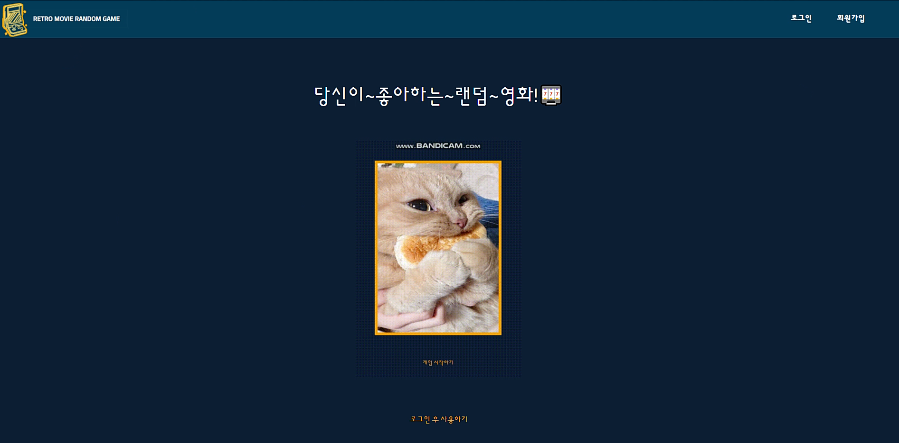
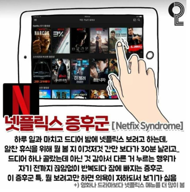
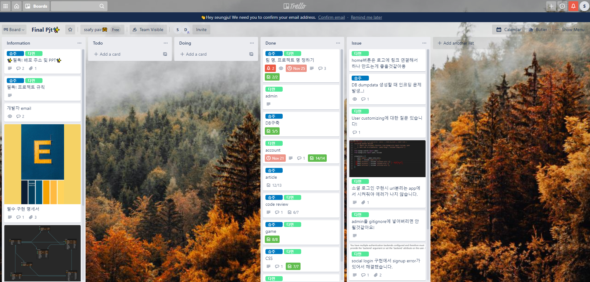
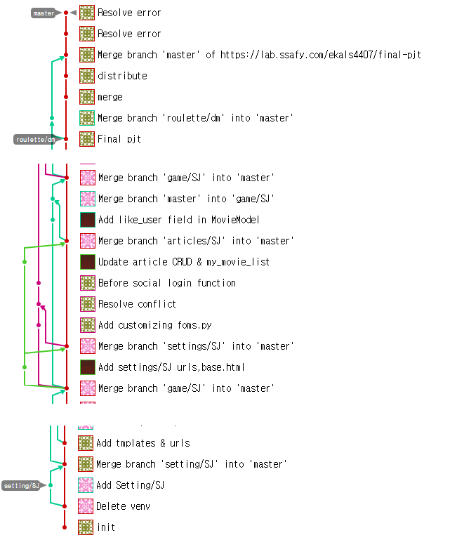

# 🎬 Movie Community

부제 : 싸피가 좋아하는 랜덤 게임




> 넷플릭스 증후군이라고 혹시 아세요?
>
> 
>
> 너무 많은 선택권이 있을 때 우리는 결정을 서로 미룹니다. 사실 저는 시간때우고 싶거든요.... `아무거나` 보고 싶거든요❗❗❗ 그래서 만들었어요. 아무거나 볼래요 🤣


<br>


# 💁‍♂️ Intro

두 개의 핵심 기능을 가지고 있습니다!

- 영화 랜덤 추천
- 영화 리뷰 커뮤니티

 그리고 특징이 있어요! 랜덤으로 영화를 추천해줄 때 저희는 `Official Trailer` 만 유저에게 제공해요! 그거만 보고 영화를 볼 지 말지 결정해야해요. (이렇게 한 이유는 시간때우고 싶은 사람들에게 최소한의 정보만 제공해주고 싶었거든요..!)  보다 자세한 웹서비스 소개는 아래에 설명했어요 😁


<br>


# 🛶Used Skill

Language :       

Framework :    

> Python Version == 3.7.9
>
> Django Version ==3.1.3


<br>


# 🛠 Setting

0. python 3.7 이상으로 설치되어 있어야 합니다.

1. 가상환경 설정 및  활성화

   ```bash
   # 프로젝트 디렉토리 (manage.py가 있는 폴더)
   $ python -m venv/venv
   $ surce venv/Script/avtivate
   ```

2. requirements 설치

   ```bash
   $ pip install -r requirements.txt
   ```

3. Youtube API 설정

   [youtube api](https://developers.google.com/youtube/v3/getting-started?hl=ko)  👈 여기에서 API_KEY를 생성할 수 있어요! 친절하게 설명되어 있으니까 쭉 따라하시면 됩니다!

   ```python
   # ./game/views.py
   
   # 예고편 보러가기
   @login_required
   def movie_detail(request,game_idx):
       tempmovie = get_object_or_404(TempMovie,poster_idx=game_idx)
       movie_pk = tempmovie.movie_id
       movie = get_object_or_404(Movie,pk=movie_pk)
       # youtube API_KEY
       API_KEYS=[
           # 여기에 API_KEY를 넣어주세요 (string)
       ]
   ```

4. 실행

   ```bash
   $ python manage.py runserver
   ```


<br>


# 🖼 Demo

이미지 클릭시 동영상 재생

- 로그인 후 추천받기

  [](https://youtu.be/PpfNvYiguk0?t=0s)


> 로그인 하기 전에 회원가입을 해야해요! 그런데요 저희는 소셜로그인을 구현했어요😎 ( 네이버 또는 구글 아이디가 있다면 충분히 영화추천 그리고 커뮤니티를 이용하실 수 있습니다.🙆‍♀️)

- 커뮤니티

  [](https://youtu.be/7PXkm49U6YQ?t=0s)


> 찜한 목록에서 
>
> 1. 영화보러가기 ( 시리즈에서 영화 구입후 보세요.👨‍✈️꼭 정당한 값을 지불해야합니다👩‍✈️)
> 2. 리뷰작성하기 ( 평점은 1~5점만 가능합니다)  -6점이상을 입력하면 리뷰가 작성이 안됩니다!!
>
> 커뮤니티에선
>
> 좋아요 순으로 인기글을 볼 수 있어요 ( 아쉽게도 최신의 인기순은 적용하지 못했어요. ~~필터링을 적용해볼게요 다음에~~)
>
> 댓글도 작성할 수 있으니까 영화에 대해 우리 토론해봐🙅‍♀️💁‍♀️🙋‍♀️


<br>


# 저희 프로젝트는요..

## 팀 소개

🍒 다민님

- 팀장님!!

- accounts 기능 구현
- 소셜 로그인 구현
- 롤렛 js 구현
- 테마 + main페이지 디자인
- game 페이지 디자인 
- 로고 제작

🌊  Me

- Article CRUD 구현
- 좋아요, 장바구니 구현
- DB 모델링 및 구현
- 데이터 가공
- 로그인 form 디자인
- 커뮤니티 디자인

## 협업툴 활용

1. Trello



2. gitlab




<br>


# 후기


쉽지 않았어요. 누군가와 함께 생각을 나누고, 서로 다른 생각을 맞춰가는 과정은 역시 쉽지 않았습니다. 그래도 서로 공유하고 있는 확실한 목표가 있었기 때문에 의견 조율을 할 수 있었어요. 함께 고생해준 다민님 🙇‍♂️샤라웃~~🙇‍♀️합니다!!

트렐로와 깃을 프로젝트 끝날 때 까지 활용했다는 점에서, 굉장히 기부니가 좋아요🤟🤟 이젠 merge할 때 충돌나도 당황하지 않아요! 우리에겐 구글이 있었고, 멘토님이 있었거든요. 그런데 이젠 멘토님(천사)이 도와주지 않을거에요. 구글만 믿어야겠어요. 


프로젝트를 할 때 한가지 중요한 이슈가 있었고, 느낀점이 있어요.

> DB ERD를 처음부터 완벽하게 완성할 수 없었어요. 그래서 중간에 DB 뒤엎고 난리가 났었죠.. DB를 구현하던 저으 ㅣ입장에서 다민님께 미안했어요. ( 그런데 난중에 들어보니 디비의 데이터를 활용하지 않아 불편함을 못느꼈다고 하더라구요. 천사처럼 말씀해주셔서 진짜 천사인줄ㅎㅎ;;)
>
> 아무튼 처음부터 ERD를 완벽하게 하는 것으 중요성을 느낄 수 있었어요. 서비스의 기능들을 처음부터 제대로 정의한다면, ERD도 그것에 맞춰서 할 수 있을 거고, 그렇다면! DB를 뒤엎을 일이 없겠죠. (그런데 실제 서비스들 중에서 기능이 추가되면 그럼 DB를 어떻게 추가로 붙일까요? 그게 갑자기 궁금해지네요...)


함께 해준 다민님, 멘토에릭님 감사합니다.  행복했던 플젝기간이었어요.